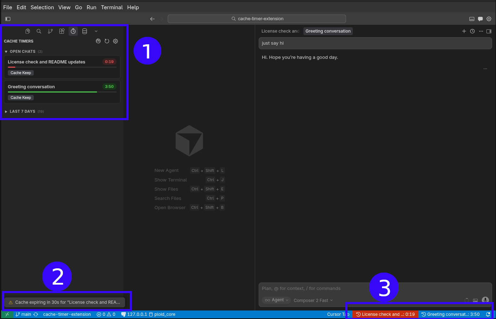

# Cache Timer Extension for Cursor

A VS Code / Cursor extension that tracks the prompt cache TTL for your LLM chat sessions.

## Screenshot



1. **Sidebar panel** — tracked chats with progress and countdown; each card has a **Cache Keep** control you can use to get nudged before the TTL runs out (see [Features](#features)).
2. **Expiry alert (≤30s)** — a notification when a chat’s cache is about to expire (there is also an alert when it has expired).
3. **Status bar** — one compact timer per open chat (`Cache: M:SS`), color-coded with the same urgency as the panel.

## Features

- **Status bar countdown** — each open chat gets its own status bar item showing `Cache: M:SS`, color-coded green/yellow/red as time expires
- **Sidebar panel** — lists all tracked chats grouped by Today, Last 7 Days, and Older
- **Click to open chat** — click any chat card in the sidebar to open that conversation in Cursor
- **Chat titles** — displays the actual chat titles assigned by Cursor
- **Streaming detection** — shows a streaming indicator when the assistant is actively responding
- **Expiry alerts** — warning notification at 30 seconds remaining, error notification when the cache expires
- **Cache Keep** — per-chat toggle that nudges you to send a keep-alive message before the cache TTL expires, extending the cache window for a configurable duration (default 30 minutes)
- **Auto-detection** — watches Cursor's agent transcript files and folder for changes; resets the timer when a new assistant response is detected
- **Configurable** — adjust both the cache TTL and keep-alive duration via settings or sidebar commands

## Installation

### From the Marketplace

Search for **Cache Timer** in the Extensions view and click **Install**.

### From VSIX

1. Get a `.vsix` file (e.g. a release asset or build one locally with `make package`).
2. Install it using one of the following:
   - **Command line (Cursor):** `cursor --install-extension cache-timer-extension-<version>.vsix`
   - **Command line (VS Code):** `code --install-extension cache-timer-extension-<version>.vsix`
   - **UI:** open **Extensions**, click **`...`** on the Extensions view title bar, choose **Install from VSIX...**, and pick the file.

Restart the editor if the extension does not activate immediately.

## Known limitations

- **WSL projects:** Some users report that the extension does not work correctly when the workspace or project lives under WSL (Windows Subsystem for Linux). Timers and chat detection may not behave as expected in that setup. If you rely on WSL-hosted paths, consider tracking this as a known gap until a fix lands.

## Settings

| Setting | Default | Description |
|---|---|---|
| `cacheTimer.ttlSeconds` | `280` | Cache time-to-live in seconds (4 min 40 sec) |
| `cacheTimer.cacheKeepDurationSeconds` | `1800` | Duration of a cache-keep session in seconds (30 min). Minimum: 60 |

## Commands

| Command | Description |
|---|---|
| `Cache Timer: Show Panel` | Opens the sidebar timer panel |
| `Cache Timer: Open Chat` | Opens the selected chat in Cursor |
| `Cache Timer: Open Settings` | Opens extension settings |
| `Cache Timer: Edit TTL` | Prompts to change the cache TTL value |
| `Cache Timer: Edit Keep Duration` | Prompts to change the cache-keep session duration |
| `Cache Timer: Refresh` | Manually refreshes timer data and sidebar |

## Development

Install dependencies and build:

```bash
pnpm install
pnpm run build
```

**`package.json` scripts**

| Script | Purpose |
|--------|---------|
| `pnpm run build` | Development bundle (`dist/extension.js`) |
| `pnpm run watch` | Rebuild on file changes |
| `pnpm run vscode:prepublish` | Production (minified) build used before packaging |

**Makefile** (optional): `make install`, `make build`, `make watch`, `make package` (builds a `.vsix` via `vsce`), `make dev` (build + symlink into Cursor’s extensions folder for local testing).

Then press **F5** in Cursor/VS Code to launch the Extension Development Host.

## Marketplace vs this README

On the marketplace **listing**, users mainly see the extension **name** (`displayName` in `package.json`), **icon**, and the **short description** (the `description` field — one line). The **full README** is what appears on the extension **detail page** as the long description when you publish the extension (for example with `vsce publish` or the equivalent for your registry). Keep screenshots and setup notes here so that page stays clear for new users.

## License

Licensed under the [GNU Affero General Public License v3.0](https://www.gnu.org/licenses/agpl-3.0.html) (SPDX: `AGPL-3.0`). The full license text is shipped with the extension as `LICENSE`.
